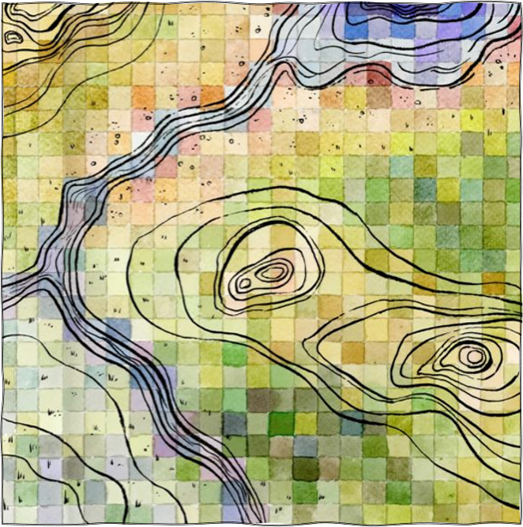

<font size="4"> 
**These LANDFIRE-Powered Landscape Assessments allow users to start exploring trends, landscape conversion and natural resource management options. **

</font> 


## Goals of this demonstration

We will use [LANDFIRE](https://landfire.gov/){target="blank"} products to:

   {
     style="float:right; margin-left:25px; margin-bottom:15px;"
     fig-alt="Artistic rendering of a pixel-based landscape.  By Leo Barch."
     width="400"
   }

1. Characterize and map past and present ecosystem conditions.
2. Explore historical disturbance patterns.
3. Summarize patterns of change and management opportunities.


The following charts, maps, and graphs are based on 2024 LANDFIRE products, and provide a starting point for further analysis.


This demonstration will:

* Provide context for the past and present ecosystem conditions of Chequamegon-Nicolet National Forest.
* Demonstrate the power of data visualization to explore ecological patterns and functions using LANDFIRE products.
* Facilitate an understanding of historical and current conditions on a regional scale.

*Pixel Painting by Leo Barch, inspired by Robin Holmes ([https://watercyclecolors.com/](https://watercyclecolors.com/)).*

## Location of this assessment


<br>

```{r libraries, message=FALSE, warning=FALSE, include=FALSE}


library(sf)
library(tmap)
library(tidyverse)


```


```{r read shapefile, message=FALSE, warning=FALSE, include=FALSE}
#  read shape
shp <- st_read("inputs/cnnf.shp") %>% 
  st_transform(crs = 5070) %>%
  st_union() %>%
  st_sf()


# Check if geometries are valid
 valid <- st_is_valid(shp, reason = TRUE)
 print(valid)

 # Fix invalid geometries if needed
 shp <- st_make_valid(shp)


```

```{r locator map, message=FALSE, warning=FALSE, echo=FALSE}


tmap_mode("view")  

dev.new(width = 8, height = 6)  #

tm_shape(shp) +
  tm_borders(col = "darkgreen", lwd = 1) +
  tm_basemap("Esri.WorldTopoMap") +
  tm_title("Chequamegon-Nicolet National Forest")


```

## How to use this web report

* All maps, input datasets and further assistance can be obtained by contacting the author, [Randy Swaty](mailto:rswaty@tnc.org){target="blank"}.
* Review is ongoing.
* To share this web app, simply share the hyperlink.
* Toggle between dark and light display of this site in the upper right corner of the page.
* Learn more about LANDFIRE and The Nature Conservancy [here](about.qmd){target="blank}. 
